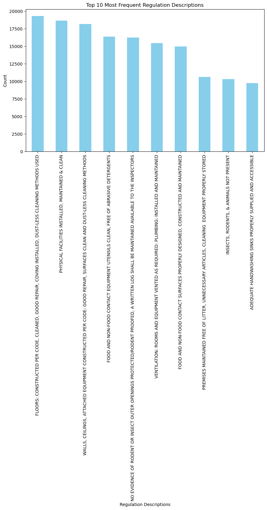
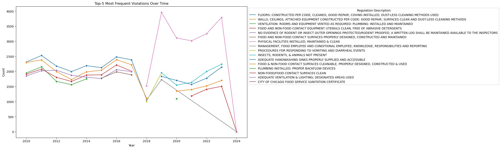
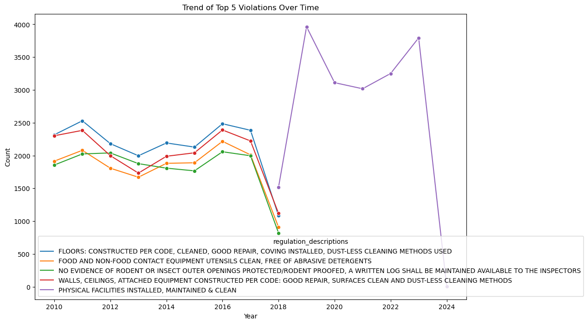

# 🍽️ Chicago Food Safety Inspection Analysis

This project analyzes historical food inspection data from the City of Chicago to identify:
- **Most common causes of failed inspections**
- **Frequent violators and business types**
- **Trends and patterns over time**

The analysis aims to promote public health and safety by making inspection insights accessible to the public and stakeholders.

---

## 📌 Project Goals

1. **Identify top violation patterns** that result in failed food inspections.
2. **Tokenize and parse violation descriptions** using various NLP techniques to find key failure phrases.
3. **Build a classification model** to predict inspection outcomes based on inspectors' comments.
4. **Visualize insights** for easy interpretation by the public and business owners.

---

## 🧠 Key Insights

### 1) Distribution of Inspection Results
Bar chart of results by outcome category.  
*Example:*  


### 2) Top 10 Common Violation Descriptions
The most frequently cited reasons for failed inspections.  
*Example:*  


### 3) Frequent Repeat Offenders
Restaurants or facilities that repeatedly fail inspections.  
*Example:*  


### 4) NLP Parsing of Violation Descriptions
Tokenized descriptions of violations using techniques like:
- Lowercasing
- Stopword removal
- Lemmatization / Stemming
- Regex filtering

Comparison of different pre-processing techniques is shown in Part B.

---

## 🔍 Project Structure

```plaintext
.
├── notebooks/
│ ├── Chicago Food Safety Inspection Analysis_Starter1.ipynb # Part A: EDA and Violation Parsing
│ ├── Chicago_Food_Inspections_Analysis_1.ipynb # Part B: NLP Token Analysis
│ ├── Chicago_Food_Inspections_Analysis_2.ipynb # Part C: Classification Model
│ └── Chicago_Food_Inspections_Analysis_3.ipynb # Part D: Visualization and Reporting
├── images/ # Generated charts and visualizations
├── html:pdf/ # Exported reports (HTML and PDF)
├── requirements.txt # Python dependencies
└── README.md # Project overview and instructions
```

---

## 🚀 How to Reproduce

### 1. Clone the Repository
```bash
git clone https://github.com/edwnhsu/Chicago-Food-Safety-Inspection-Analysis.git
cd Chicago-Food-Safety-Inspection-Analysis
```

### 2. Install Dependencies
```bash
pip install -r requirements.txt
```

### 3. Run the Notebooks
Open each notebook in the `notebooks/` folder to explore different parts of the analysis:
- **Part A**: Exploratory Data Analysis
- **Part B**: Violation Token Analysis
- **Part C**: Text Classification Model
- **Part D**: Final Visualization and Reporting

---

## 🧪 Techniques Used
- **Pandas, Matplotlib, Seaborn** for data manipulation and visualization
- **NLTK, spaCy** for text pre-processing
- **Scikit-learn** for building classification models
- **WordClouds and Frequency Analysis**
- **Regex and string parsing**

---

## 📬 Contact

**Yu-Wei (Edwin) Hsu**  
GitHub: [@edwnhsu](https://github.com/edwnhsu)  
Email: edwinhsu@uchicago.edu